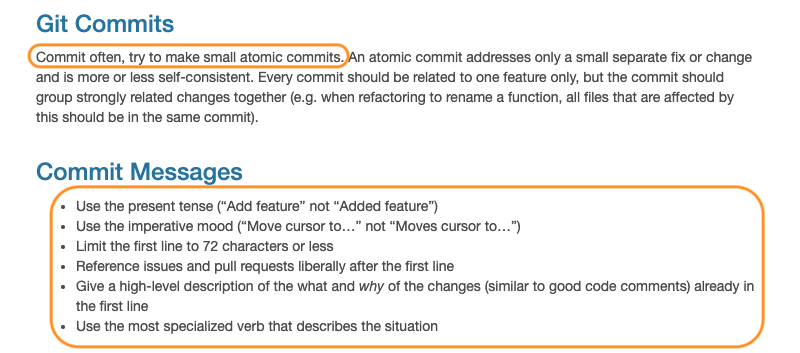

# aLilSpec

The purpose of this blog is to keep track of and share interesting things learned in Spectroscopy and related areas of applied quantum mechanics. Additionally, this repo will serve as a space for documenting my contributions to the r-hyperSpec team, as well as, developments in the larger Computational Spectroscopy community.

## A return to `hyperSpec`
First, I should say I don't plan on writing a post everytime I contribute to hyperSpec or any related packages. However, I believe writing helps with organizing thoughts. And because it has been approximately two years since I've actually contribued to the hyperSpec ecosystem, I've gathered a lot of thoughts. So, as I return to make contributions I want to try an incentivze distillation Also, there are a number of things that I think are important to have in order before one contributes to an open source project, and specifically the r-hyperspec project and I wish to outline them here for myself and others.

### Contributing
I think contributing to an open source project can be super rewarding. For one, you get to interact with a number of interesting people from all around the world (e.g., the r-hyperspec team regularly represents 5/24 timezones). Second, it's an opportunity to improve one's skillset in the open. And of course, the reason one endeavors to contribute to an open source project in the first place is because they find the project cool, or its development important and ultimately worth learning more about. Personally, I think the R programming language is cool and I want to learn more about the nature of light, quantum computing, and their application to plant ecology and art (i.e., the purpose of this blog).

Additionally, there are organizations and programs like [Google Summer of Code](https://summerofcode.withgoogle.com/) that give monetary rewards to students for contributing to open source projects during the summer.

#### Contributing Guidelines
Okay, so I've shared a few reasons on *why* it's a good idea to contribute to an open source project. In terms of *how* to contribute: The above mentioned Google Summer of Code organization gives some great tips [here](https://google.github.io/gsocguides/student/making-first-contact). But in essence, an open source project should have some sort of community/contributors guidelines. In theory, this document/page should tell one all they need to know about successful contributions. For the r-hyperspec team, this such document can be found [here](https://r-hyperspec.github.io/hyperSpec/CONTRIBUTING.html).

**And so**, because it has been **two years** I will now reread this document before making a contribution...

I have *cherry-picked a few sections that I think are particulary important for any open source project to include guidelines about:
 

1. Coding contributions come in the form of bug fixes and/or feature additions. If the organization is using GitHub, then it is important to check the repositories issues tab first. You know because the whole: "Great minds blah, blah, blah." Though, I think the following is more accurate: "People have <s>similar</s> issues."

---

1. For people like myself, **consistency**, **test**, and **cohesion** can be scary in many contexts. In the context of software development, these are the primary activities of **quality control**.

---

3. There is "Publish or Perish", "Demo or Die", and "Document or Disintegrate." Vignettes in R package management are critical to documentation and guiding users through functionality.

---

4. Leave it to the chemist to come up with sound branch naming conventions. Pull requests (PRs) are where the collaboration goes down and can be a lot of fun!

---

5. When I first started contributing to hyperSpec in the summer of 2020 I had a bad habit of submitting large commits — perhaps a result of perfectionism — and writing opaque commit messages — some combination of laziness and confusion. Tbh I'm still working on both of these aspects.

**Of course, if you are interested in contributing to hyperSpec (or any project) then please read the entire contributing guidelines*

### Setting up Systems for Contribution
Okay, so `hyperSpec` is a package that depends on and make use of a lot of things (e.g., R itself, `pkgdown`, `styler`, `roxygen`, `testthat`; **GitHub Actions**, **Travis CI**). Thus, I want to make sure my systems are up to date with the other contributors (i.e., R version, RStudio, R packages) so that my development environment is in order. The following links are helpful:

* [How to Install/Update R and RStudio](https://www.r-bloggers.com/2022/01/how-to-install-and-update-r-and-rstudio/)
* [Updating R, RStudio, and Your Packages](https://bookdown.org/pdr_higgins/rmrwr/updating-r-rstudio-and-your-packages.html)
* [A newbie guide to running multiple version of R on a Mac](https://daryavanichkina.com/posts/2020-rswitch-guide/)

#### R Package Development

For the most comprehensive overview of R package development, RStudio provides a [cheat sheet](https://rawgit.com/rstudio/cheatsheets/main/package-development.pdf). Additionally, I still reference John Muschelli's [R Package Development playlist](https://www.youtube.com/watch?v=79s3z0gIuFU&list=PLk3B5c8iCV-T4LM0mwEyWIunIunLyEjqM). Basically the process is this:

1. Create/Make changes to code
2. Save and load code into memory (`devtools::load_all()`)
3. Experiment with code in console
4. Repeat steps 1-3 until desired functionality is implemented
5. Add test for functionality via `testthat`
6. Document via comments
7. Organize code as necessary
8. Repeat steps 1-6 until package functionality is implemented
9. Instrument additional package infrastructure
   * Description file
   * Vignettes
   * CI/CD tooling
   * Adding data
10. Check package (`devtools::check()`)
11. Repeat step 10 until there are no errors or warnings

### An Example Contribution

At the beginning of summer 2020 I [briefly wrote](https://eoduniyi.github.io/hyperSpec.gsoc2020/) about *what* types of contributions one can make. Basically, there are **coding contributions** (CCs) and **non-coding contributions** (NCCs). The contribution I'm going to be making is a a CC. In particular, I need to fix the unit test associated with the `hypSpc.dplyr` package (interface between `hyperSpec` and `dplyr`). This is issue [<s>#48</s>](https://github.com/r-hyperspec/hySpc.dplyr/issues/48), [#51](https://github.com/r-hyperspec/hySpc.dplyr/issues/51) and [#52](https://github.com/r-hyperspec/hySpc.dplyr/issues/52). These issues have mostly arisen due to changes in the `dplyr` package. At any rate, this contribution like all other contributions will look like the following steps:

1. Look at the issue request
2. Ask questions if necessary
3. Create a new branch
4. Start a draft PR
5. Solve issue
6. Create real PR
7. Ask for review
8. Make necessary changes
9. Merge changes into branch target

#### Issue 51

Again, the issue here is that `filter(.testdata, spc > 100)` fails because since [`dplyr` 1.0.8](https://dplyr.tidyverse.org/news/index.html) `filter()` stops accepting matrices. This is a problem because `hyperSpec` objects are defined by their special data spectra column `$spc` (which is actually a matrix 🤪 ).

The solution to this has already been solved with the `hyperSpec` functions `all_wl()` and `any_wl()`, which are analog to `if_any()` and `if_all()`. One of the two functions is required to `filter` the spectra as they remove the row ambiguity. And thus, the actual change that was requested of me was to disable skipping test in **filter.R**. This resulted in me realizing that there was an identical test that should be removed. In fact, because that is all I had to do was fix a unit test, I created a PR for issue #52, then merged the changes made in the PR for issue #51 into it.

#### Issue 52

The issue here is that there are skipped tests in the other files within the package (i.e., **transmute.R**, **slice.R**). For **transmute.R** I also need to fix the poorly written tests. For both **transmute.R** and **slice.R**, I need to implement grouping and a test for grouping.
